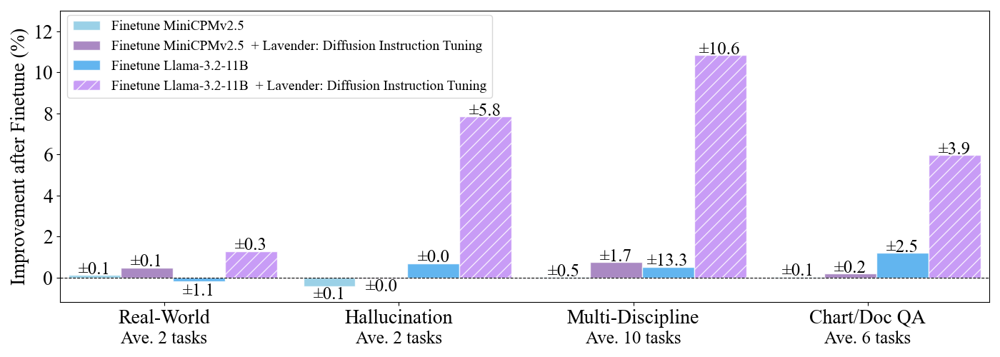
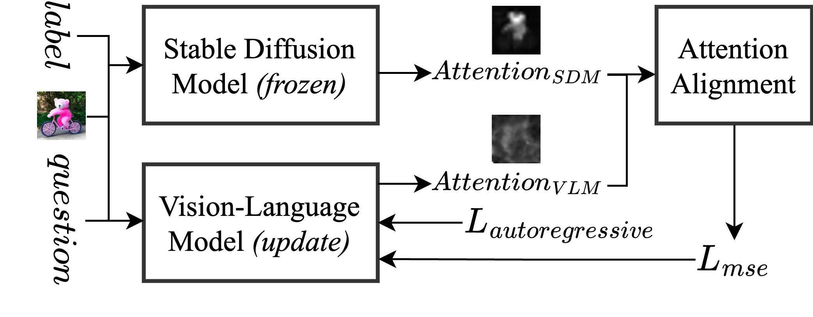
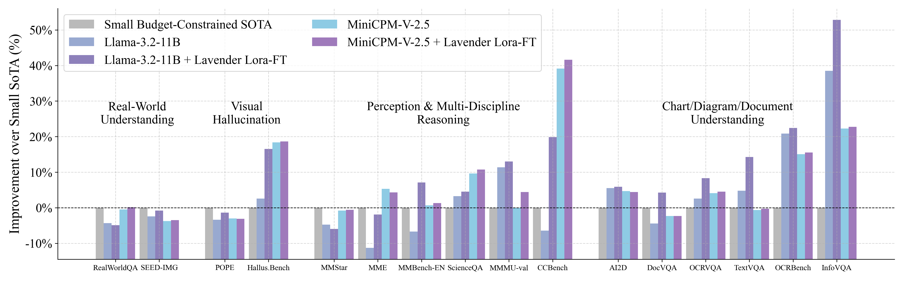
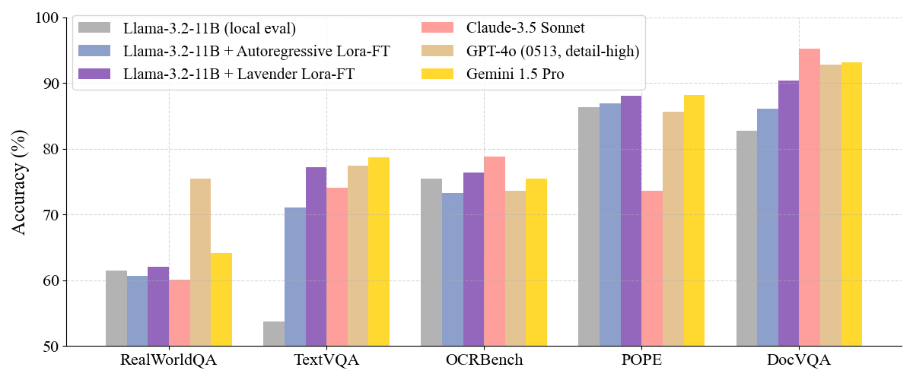
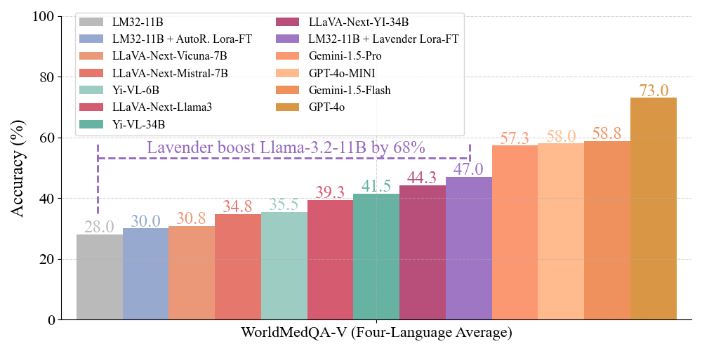

<!-- markdownlint-disable first-line-h1 -->
<!-- markdownlint-disable html -->
<!-- markdownlint-disable no-duplicate-header -->

<div align="center">
  <h1 style="color: #D3A4F7;">Lavender: Diffusion Instruction Tuning</h1>
  Boosting state-of-the-art vision-language model with Stable Diffusion
</div>
<hr>
<div align="center" style="line-height: 1;">
  <a href="https://astrazeneca.github.io/vlm/" target="_blank" style="margin: 2px;">
    
    </a>
    <a href="https://a5ee46b3a15c22102e.gradio.live" target="_blank" style="margin: 2px;">
    
  </a>
  <a href="https://arxiv.org/abs/2502.06814" target="_blank" style="margin: 2px;">
    
  </a>
  <a href="https://huggingface.co/collections/lxasqjc/lavender-diffusion-instruction-tuning-67af4dc7ec92869e73365325" target="_blank" style="margin: 2px;">
    
  </a>
</div>

<div align="center" style="line-height: 2;">
  <a href="https://twitter.com/Jinchen027" target="_blank" style="margin: 2px;">
    
  </a>
  <a href="https://astrazeneca.github.io/vlm/static/images/lavender_wechat.png" target="_blank" style="margin: 2px;">
    
  </a>
  <a href="https://www.apache.org/licenses/LICENSE-2.0.txt" style="margin: 2px;">
    
  </a>
  
</div>


## 1. Introduction

**Lavender: Diffusion Instruction Tuning**  
Lavender is a simple supervised fine-tuning (SFT) technique that boosts state-of-the-art vision-language models (VLMs) by aligning their per-token attention with the powerful text-to-image (T2I) attention of Stable Diffusion. By transferring this visual expertise, Lavender enhances image-to-text (I2T) generation—delivering significant gains, improved out-of-distribution robustness, and data efficiency with minimal compute.

Inspired by recent efforts revealing that visual understanding in VLMs lags behind language capabilities, Lavender addresses this gap with a simple yet effective MSE loss alignment. Our results demonstrate:
- **Significant Gains:** up to +30% performance improvement on 20 tasks; +68% on challenging OOD benchmarks.
- **Data Efficiency:** Achieving these results with only 0.13M samples (~2.5% of typical VLM datasets).
- **Low Compute:** Finetuning in approximately one day on 8 NVIDIA A10G GPUs.
- **Model-Agnostic:** Compatible with leading VLMs like Llama-3.2-11B, MiniCPMv2.5, OpenFlamingo, and more.
- **Precise Alignment:** Directly transfers Stable Diffusion’s robust T2I attention to improve text-region mapping.
- **Open-Source:** Code, data, and finetuned models are available for the community.

<p align="center">
  
</p>

## 2. Method Summary

Lavender builds upon visual instruction tuning by introducing a lightweight alignment module that minimizes the mean squared error (MSE) between the cross-attention distributions of a Stable Diffusion model and a VLM. This alignment process guides the VLM to adopt superior text-to-region correlations, ultimately boosting its image-to-text generation capabilities.

<p align="center">
  
</p>

## 3. Attention Alignment Data

In the data preprocessing phase, Lavender leverages the vision capabilities of Stable Diffusion by extracting per-token attention from existing data, establishing a gold standard for alignment prior to fine-tuning. Processed subset are provided as examples.

<div align="center">

| **Source Data** | **Full Dataseet Size** | **Subset Size** | **Download** |
| :------------: | :------------: | :------------: | :------------: |
| [Flickr30k](https://huggingface.co/datasets/nlphuji/flickr30k) | 31,783 | 1,000   | [🤗 HuggingFace](https://huggingface.co/datasets/lxasqjc/flickr1k-sd-attn)   |
| [RLAIF-V-83K](https://huggingface.co/datasets/BUAADreamer/RLAIF-V-83K) | 83,132 | 1,000   | [🤗 HuggingFace](https://huggingface.co/datasets/lxasqjc/rlaif1k-sd-attn)   |
</div>


## 4. Model Downloads

### Lavender-Llama-3.2-11B Models

<div align="center">

| **Model** | **Base Model** | **Lavender Model Size** | **Download** |
| :------------: | :------------: | :------------: | :------------: |
| Lavender-Llama-3.2-11B-Lora | [Llama-3.2-11B](https://huggingface.co/meta-llama/Llama-3.2-11B-Vision-Instruct) | 23M (LoRA) |[🤗 HuggingFace](https://huggingface.co/lxasqjc/lavender-llama-3.2-11b-lora)   |
| Lavender-Llama-3.2-11B-Full   | [Llama-3.2-11B](https://huggingface.co/meta-llama/Llama-3.2-11B-Vision-Instruct) | 40G (Full) | [🤗 HuggingFace](https://huggingface.co/lxasqjc/lavender-llama-3.2-11b-full)   |

</div>

Lavender-Llama-3.2-11B-Lora & Lavender-Llama-3.2-11B-Full are finetuned based on Llama-3.2-11B-Vision-Instruct. 


## 5. Usage & How to Run Locally

For instructions on running the Lavender inference pipeline and evaluating models locally, please refer to our [Usage Guide](./USAGE.md).

**Example inference script (Lavender-Llama-3.2-11B-Lora):**
```bash
from transformers import MllamaForConditionalGeneration, MllamaProcessor
from peft import PeftModel
import requests
import torch
from PIL import Image

# Define model paths
base_model_name = "meta-llama/Llama-3.2-11B-Vision-Instruct"
lora_model_name = "lxasqjc/lavender-llama-3.2-11b-lora"

# Load base model
base_model = MllamaForConditionalGeneration.from_pretrained(
    base_model_name,
    torch_dtype=torch.bfloat16,
    device_map="auto",
)
processor = MllamaProcessor.from_pretrained(base_model_name)
# Load LoRA adapter
lora_model = PeftModel.from_pretrained(base_model, lora_model_name)

url = "https://huggingface.co/datasets/huggingface/documentation-images/resolve/0052a70beed5bf71b92610a43a52df6d286cd5f3/diffusers/rabbit.jpg"
image = Image.open(requests.get(url, stream=True).raw)

messages = [
    {"role": "user", "content": [
        {"type": "image"},
        {"type": "text", "text": "If I had to write a haiku for this one, it would be: "}
    ]}
]
input_text = processor.apply_chat_template(messages, add_generation_prompt=True)
inputs = processor(
    image,
    input_text,
    add_special_tokens=False,
    return_tensors="pt"
).to(lora_model.device)

output = lora_model.generate(**inputs, max_new_tokens=30)
print(processor.decode(output[0]))

```
## 6. Evaluation Results

**Lavender improves MiniCPM-V-2.5 and Llama-3.2-11B, surpassing Small Budget-Constrained SOTA by up to 50%.**

<p align="center">
  
</p>

*This plot highlights the key zero-shot accuracy results across 16 VLM benchmarks, focusing on Small Budget-Constrained Models. Lavender shows its greatest improvements in Chart, Diagram, and Document Understanding, relying on precise text-visual alignment in OCR tasks. Moderate gains are observed in Perception and Multi-Discipline Reasoning and Hallucination, while the weakest improvements occur in Real-World Visual Understanding, which requires broader knowledge. For a comprehensive comparison of our method against 23 baseline VLMs, please refer to [Table 1 in our paper](https://arxiv.org/abs/2502.06814).*

**Among Large SOTA Models, Lavender-Llama-3.2-11B demonstrates comparable performance to certain High-Resource State-of-the-Art Models at least an order of magnitude larger.**

<p align="center">
  
</p>

**Without tuning on medical dataset, Lavender boosts Llama-3.2-11B's performance on the out-of-distribution benchmark WorldMedQA by 68%.**

<p align="center">
  
</p>

## 7. License
This repository and all associated code are licensed under the [Apache-2.0](https://www.apache.org/licenses/LICENSE-2.0.txt) License. 
Lavender finetuned models are also under their original base model licences: 

- Lavender-Llama-3.2-11B-Lora & Lavender-Llama-3.2-11B-Full are derived from Llama-3.2-11B-Vision-Instruct and is originally licensed under [llama3.2 license](https://huggingface.co/meta-llama/Llama-3.2-1B/blob/main/LICENSE.txt).
- Lavender-MiniCPMv2.5-Lora & Lavender-MiniCPMv2.5-Full are derived from 
MiniCPM-Llama3-V-2_5, which is derived from Llama3 and licensed under [llama3.1 license](https://huggingface.co/meta-llama/Llama-3.1-8B/blob/main/LICENSE).

Copyright AstraZeneca UK Ltd. or its affiliates. All Rights Reserved.
## 8. Citation

If you make use of our work, please cite our paper:

```
@misc{jin2025diffusioninstructiontuning,
    title={Diffusion Instruction Tuning}, 
    author={Chen Jin and Ryutaro Tanno and Amrutha Saseendran and Tom Diethe and Philip Teare},
    year={2025},
    eprint={2502.06814},
    archivePrefix={arXiv},
    primaryClass={cs.LG},
    url={https://arxiv.org/abs/2502.06814}, 
}
```
